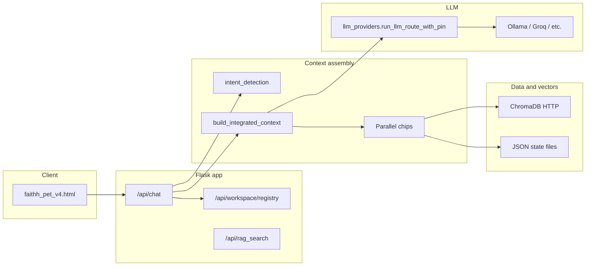

# FAITHH backend — structural overview

**Canonical process:** `faithh_professional_backend_fixed.py` (Flask, default port **5557**).  
**Supporting library code:** `backend/*.py` plus optional root modules imported by the app.

This document is the map; the code uses `# Logic for Humans:` comments on major functions to restate behavior in plain English.

---

## High-level data flow

1. **HTTP request** hits a Flask route (most important: `POST /api/chat`).
2. **Intent** (`backend/intent_detection.py`) classifies the user message (self-query, RAG, ALIFE, governance, etc.).
3. **Context** is assembled in `build_integrated_context`: parallel “chips” pull conversation history, memory, decisions, project state, scaffolding, project tree snapshot, and optional Chroma RAG (`smart_rag_query` → `query_collection`).
4. **LLM** invocation goes through `backend/llm_providers.py` (`run_llm_route_with_pin`, driven by `configs/model_config.yaml`).
5. **Side paths:** security middleware may validate JSON bodies; session metrics may write to a dedicated Chroma collection; PULSE / genomic / filesystem features branch off when enabled and when routes or tool-intent regexes match.

---

## File roles (what imports what)

| Piece | Role |
|--------|------|
| **`faithh_professional_backend_fixed.py`** | Flask app, routes, Chroma client wiring, session store, chip orchestration, RAG orchestration, most `/api/*` endpoints. |
| **`backend/llm_providers.py`** | Multi-provider LLM calls (Ollama, Groq, OpenAI-compatible webui, Anthropic), routing, streaming helpers, complexity / “simple chat” detection. |
| **`backend/intent_detection.py`** | `detect_query_intent` — regex/heuristic flags used to choose chips and RAG branches. |
| **`backend/context_builders.py`** | Builds text blocks from `faithh_memory.json`, decisions log, project state, scaffolding, personalities, project tree, Constella snippets. |
| **`backend/data_loaders.py`** | Load/save JSON state files (`MEMORY_FILE`, `DECISIONS_LOG`, etc.). |
| **`backend/rag_processor.py`** | `normalize_rag_hit_for_api` — stable shape for RAG hits returned to the UI/API. |
| **`backend/security_middleware.py`** | Optional rate limit + JSON validation + sanitization; `require_security` decorator. |
| **`backend/connection_monitor.py`** | Service health / fallback hooks; `create_health_endpoint` factory. |
| **`backend/cache.py`**, **`backend/response_cache.py`**, **`backend/performance.py`** | Response caching and timing hooks. |
| **`backend/session_metrics.py`** | Session open/close and chat-derived metrics (Chroma metrics collection, not RAG KB). |
| **`backend/enhanced_chip_integration.py`** | Program Advance / chip fusion (imported for hybrid detection and context merge). |
| **`backend/coherence_arbiter.py`** | Optional coherence pass over RAG + response (when enabled). |
| **`filesystem_chip.py`**, **`knowledge_graph.py`** (repo root) | File operations and graph context when import succeeds. |
| **`pulse_pattern_tracker.py`** (repo root) | PULSE personalization / proposals when import succeeds. |
| **`app/services/*`** | Genomic impedance, auth, Constella constitution, focus — **optional**; guarded by `try/import` flags in the main file. |

**Not imported by this backend:** `services/rag_api.py` and `services/project_hub/app.py` are separate Flask apps (sidecars).

---

## Sections inside `faithh_professional_backend_fixed.py` (conceptual)

Rough order as you read the file top to bottom:

1. **Imports and feature flags** — Phase 2 ML, genomic, auth, etc.
2. **Performance / metrics helpers** — chat perf log, VRAM sampling, Prometheus hooks.
3. **GPU / model heuristics** — `select_gpu_aware_model` (legacy-style picker; YAML routing also exists).
4. **Flask `app` creation** — middleware, connection monitor, optional services.
5. **Configuration** — env vars, Chroma URL, embedder settings, `configs/model_config.yaml` load.
6. **Chroma + embedder** — `get_query_embedder`, collection handles, heartbeat / reconnect logic.
7. **ML chips file load** — `activate_ml_chips` for disk-based chip JSON.
8. **RAG primitives** — `query_collection`, `query_alife_collection`, merge/rerank, `smart_rag_query`.
9. **Ollama HTTP helper** — `_ollama_post`.
10. **Sessions** — in-memory `conversation_sessions`, cleanup, history formatting.
11. **Background indexing** — queue thread writing live chats into Chroma when connected.
12. **Chip retrieval functions** — `retrieve_*` used by `build_integrated_context`.
13. **RAG signal** — `update_last_rag_retrieval_signal` for low-confidence banner + registry.
14. **Tool-intent augmentation** — `augment_context_for_tool_intents` (PULSE / genomic snapshots).
15. **`build_integrated_context`** — thread-pool parallel chip collection + token budgets.
16. **Flask routes** — static UI, `/api/chat`, search, upload, RAG, workspace registry, pulse, compass, metrics, health, etc.

---

## GPU / CUDA policy (strict LLM workstation)

After `.env` is loaded, `apply_faithh_llm_cuda_env()` in `backend/llm_providers.py` sets `CUDA_DEVICE_ORDER=PCI_BUS_ID` and, when `FAITHH_STRICT_LLM_GPU` is on (default), **overwrites** `CUDA_VISIBLE_DEVICES` with `FAITHH_CUDA_PHYSICAL_DEVICE` (default `1` = second physical GPU, e.g. RTX 3090). The RAG embedder temporarily clears visibility for import, then `apply_faithh_llm_cuda_env()` runs again in `finally` to restore policy.

**Where `apply_faithh_llm_cuda_env()` runs (Logic for Humans):** (1) **Module boot** — immediately after `load_dotenv()` in `faithh_professional_backend_fixed.py` (`_FAITHH_CUDA_POLICY`). (2) **RAG embedder** — `get_query_embedder()` `finally` block after SentenceTransformer import/load so the process returns to the pinned GPU map. (3) **ML chip resync subprocess** — `_run_resync` copies `os.environ` and sets `CUDA_DEVICE_ORDER` / `CUDA_VISIBLE_DEVICES` to `get_faithh_cuda_physical_device_index()` before spawning `ml/chip_resync.py`. Other `subprocess.run` calls inherit the already-pinned Flask environment.

**UI handshake:** `GET /api/health/gpu-hint` returns `build_gpu_hint_payload()` — `alignment` is `MATCH` when `CUDA_VISIBLE_DEVICES` equals `FAITHH_CUDA_PHYSICAL_DEVICE` (after policy). The payload includes `ollama_note` because **Ollama** must still be started with the same visibility; otherwise chat hits the wrong GPU regardless of Flask.

See also: `docs/architecture/FAITHH_UI_COMPONENT_MAP.md` (chat → chips → Ollama).

## Configuration touchpoints

| Source | Used for |
|--------|-----------|
| **Environment (`.env`)** | API keys, `CHROMA_HOST` / `CHROMA_URL`, `OLLAMA_HOST`, model overrides, feature toggles. |
| **`configs/model_config.yaml`** | Provider definitions and route order for `run_llm_route_with_pin`. |
| **`config.yaml`** | Repo-level AI hints (`FAITHH_REPO_CONFIG`). |
| **JSON state files** (via `data_loaders`) | Memory, decisions, projects, scaffolding. |

---

## Related docs

- `docs/architecture/BACKEND_API.md` — HTTP surface (when maintained).
- `AGENTS.md` — ports, canonical backend name, registry rule for new features.
