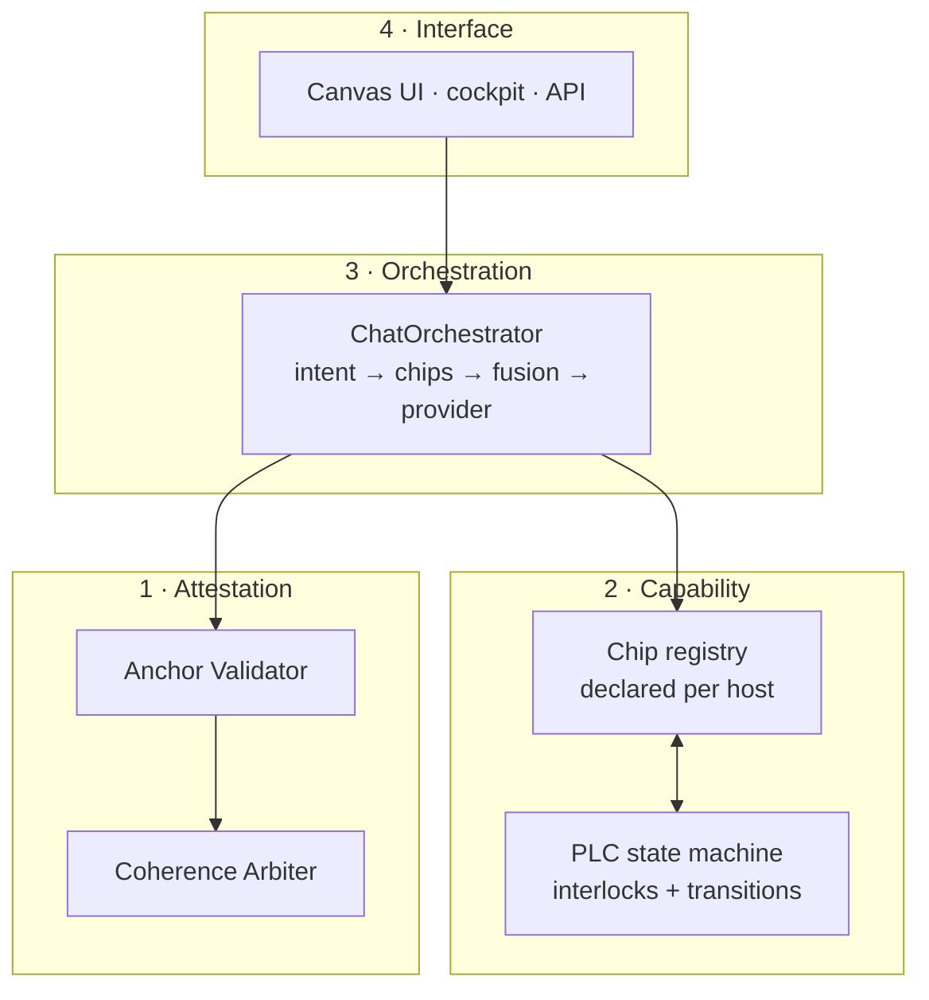

# FAITHH Redesign — concept inventory and target architecture

**Status:** design draft · **Written:** 2026-07-28
Companion to [COMPONENT_INDEX.md](COMPONENT_INDEX.md) (generated, factual) — this
document is the argument; that one is the evidence.

---

## 0. The premise

The system has been developed far more than it has been used. That shows in the
shape: `faithh_professional_backend_fixed.py` is **6,725 lines with 111 routes and
143 functions**, while four smaller, better-structured backends sit unused around
it. The good architecture was attempted several times and lost to accretion each
time.

So the redesign is **extraction, not invention**. Almost everything below already
exists somewhere in the repo. The work is pulling it out of the monolith, naming
it, and giving it a boundary.

---

## 1. Concept inventory — what is actually here

Six clusters, recovered from module docstrings rather than from memory.

### 1.1 Attestation (the differentiator)

| Module | What it does |
|---|---|
| `backend/anchor_validator.py` | *"Validates specific claims from canonical state files against actual system behavior."* |
| `backend/coherence_arbiter.py` | Measures semantic convergence between RAG retrieval and ML chip activation |
| `backend/coherence_sensor.py` | Output-Coherence Sensor (from `harmony_ai_bridge_v1.0.0.md`) |

**This is the most important thing in the codebase and it is buried.** The Anchor
Validator is attestation already implemented — it checks FAITHH's claims about
itself against live behaviour rather than trusting state files.

The Coherence Arbiter is the same epistemics one layer up: two *independent*
retrieval signals (semantic RAG, ML chip routing) must converge before confidence
rises. That is structurally the same argument as the ALife repo's Rust port
reproducing the Python reference bit-for-bit — a second, independent path to the
same answer is what licenses belief.

### 1.2 Capability — the Chip system

`filesystem_chip.py` · `backend/parallel_chip_engine.py` ·
`backend/enhanced_chip_integration.py` · `backend/chip_weight_metrics.py`

Pluggable capabilities (`ChipResult`, `ChipRetriever`, `ParallelChipEngine`) with
weighted **RRF fusion** across parallel retrievers, plus *Program Advance*
detection — combinations of chips that produce an effect no single chip does.
The Battle Network metaphor is not decoration; it is a real plugin architecture
with a fusion policy.

### 1.3 Host control — the PLC state manager

`backend/plc_state_manager.py` — `SystemState`, `InputSensor`, `OutputActuator`,
`StateTransition`, `SystemStatus`. A deterministic state machine with safety
interlocks, borrowed from industrial control.

Unusual for an AI system, and exactly the right primitive for running across
heterogeneous hosts: a machine declares which sensors and actuators it has, and
the state machine refuses transitions the host cannot support.

### 1.4 Memory and retrieval

`backend/tiered_rag_processor.py` (three-tier storage with access-pattern
tracking) · `knowledge_graph.py` (YAML graph for self-awareness reasoning) ·
`backend/context_builders.py` · `backend/intent_detection.py`

### 1.5 Emergence

`pulse_pattern_tracker.py` — watches interactions to detect *chip-worthy
patterns*. Capability discovery from usage rather than from design.

### 1.6 Orchestration (attempted, abandoned)

`backend/faithh_unified_api.py` contains a `ChatOrchestrator` class — the
transport/logic separation the monolith never achieved. 402 lines against 6,725.
`backend/faithh_backend_v4_template.py` has the `Config` class the monolith
lacks. Both are unused. Both are the right shape.

---

## 2. Target architecture

Four layers. Each has one job and a boundary that can be tested.



**Layer 1 — Attestation.** Every claim FAITHH makes about itself or its retrieval
carries a tier: `confirmed` (anchor-validated against live behaviour),
`asserted` (from a state file, unverified), `speculative` (generated). The
Coherence Arbiter supplies the convergence score that can promote `asserted` to
`confirmed`. **Nothing above this layer may assert a tier it did not earn.**

**Layer 2 — Capability.** A host manifest declares what exists here; chips
register against declared capabilities; the PLC state machine enforces legal
transitions. A host without a GPU simply has no inference chip — not a failing
one.

**Layer 3 — Orchestration.** Intent detection → chip selection → parallel
retrieval → RRF fusion → provider dispatch. This is `ChatOrchestrator`, resurrected
and made the only path. Transport (Flask routes) becomes a thin shell over it.

**Layer 4 — Interface.** Routes, UI, API. Should contain no logic. Today it
contains most of it.

---

## 3. Relationship to Constella

The requirement is to **complement Constella while retaining independent
attestation**. The clean split:

| | Constella | FAITHH |
|---|---|---|
| Unit | a community / population | a single agent on a single host |
| Question | how does a group decide legitimately | how does one system stay honest about what it knows |
| Receipt | governance record, ALife experiment | anchor validation against live behaviour |
| Vocabulary | `confirmed` / `asserted` / `speculative` | **the same vocabulary** |
| Dependency | — | **none** — FAITHH must attest with the network absent |

Shared vocabulary, independent machinery. FAITHH running on a laptop with no
network still has a complete attestation story. If it later participates in a
Constella network, its local receipts are already in the right shape to publish.

**On testing this with ALife:** the method transfers, the substrate does not.
ALife tests population dynamics; attestation is a single-agent epistemic property.
The right test is adversarial rather than simulated — *can FAITHH be induced to
assert something the Anchor Validator would reject?* That is a test suite.

---

## 4. Foundations to settle first

These are cross-cutting and cheap to get wrong later.

### 4.1 Host capability manifest

Four operating systems are in play: **Windows** (this workstation),
**Linux** (Gen8), **macOS** (MacBook), **Proxmox + guests** (rebuild pending),
and soon **WSL2** as a fifth environment on Windows.

Needed: a per-host manifest — the same idea as `infra/hosts.yaml` in the homelab
repo, but describing *capabilities* rather than addresses:

```yaml
host: desktop-iifeikl
os: windows
gpu:   { present: true, name: "RTX 3090", vram_gb: 24, cuda: "12.6" }
python: "3.12"
roles: [inference, embedding, dev]
chips:  [filesystem, inference_local, embedding]
absent: [plex_transcode, always_on]
```

The PLC state manager consumes this. It also makes "adaptable to each host"
a data question rather than a code-branching one.

### 4.2 Transport — already solved

Tailscale MagicDNS is the substrate: every host reachable by name from anywhere,
no LAN dependency. FAITHH components address each other by
`<host>.taileb8c60.ts.net`, never by IP. This is settled; do not re-litigate it.
See `docs/architecture/NETWORK_DESIGN.md` in the homelab repo.

### 4.3 Codebase structure

The extraction target:

```
faithh/
  attestation/    anchor_validator, coherence_arbiter, tiers
  capability/     chip registry, host manifest loader, plc state machine
  chips/          filesystem, rag, inference, ...   (one module each)
  orchestration/  chat_orchestrator, intent, fusion
  providers/      groq, anthropic, gemini, ollama, vllm   (uniform interface)
  transport/      flask routes — thin
```

Rule going in: **a module that cannot state its layer does not belong.** The
6,725-line file becomes `transport/` plus a lot of deletions.

### 4.4 Inference — local and cloud

The power lesson from 2026-07-27 is architectural, not incidental: **the Gen8
cannot sustain GPU compute**. So inference lives on the workstation and the Gen8
consumes it over the tailnet — the same split that made the embedding pipeline
work.

- **Serving:** vLLM under WSL2 (Linux-first; the AWQ models already on the NAS
  are a vLLM format). Ollama is easier but GGUF-only.
- **Fallback:** Groq / Anthropic / Gemini already configured and working.
- **Important:** AWQ is an *inference* format. Fine-tuning happens on fp16/bf16
  base weights with LoRA/QLoRA, then merge, then quantize to AWQ to serve. The
  `qwen2.5-14b-awq` and `qwq-32b-awq` on the NAS are for running, not training.

---

## 5. Sequence

1. **Extract Layer 1.** Attestation is small, self-contained, and the reason the
   project exists. Give it a package, a test suite, and the adversarial test.
2. **Write the host manifest** for the four (soon five) environments.
3. **Resurrect `ChatOrchestrator`** as the only path; make routes a shell.
4. **Register chips against manifest capabilities**; delete the ones nothing uses
   (see COMPONENT_INDEX — 26 modules currently have no importer).
5. **Stand up local inference** on the 3090 under WSL2; keep cloud as fallback.
6. Only then consider fine-tuning — a base model is worth little until there is a
   clean dataset, and the dataset comes from the ingested corpus.

## Open questions

- Does the Coherence Arbiter's convergence score have a defensible threshold, or
  is it currently a magic number? (Needs an honest answer before it gates tiers.)
- `pulse_pattern_tracker` proposes new chips from usage — who approves them?
  Automatic capability growth needs the same approval gate the NAS ingest has.
- Three-tier RAG storage predates the 768-dim consolidation; does tiering still
  earn its complexity now that there is one canonical collection?
