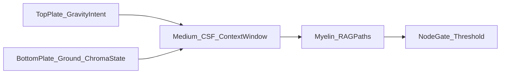

# Harmonic Body ↔ FAITHH / ALIFE architecture bridge

This note maps the Harmonic Body framework ([`docs/research/harmonic_body/HARMONIC_BODY.md`](../research/harmonic_body/HARMONIC_BODY.md)) onto the FAITHH stack so both can be reasoned about together.

## RAG wiring (verified)

Before mapping **Node of Ranvier** to retrieval thresholds, the current codebase uses:

- **Retrieval path:** `smart_rag_query()` in `faithh_professional_backend_fixed.py` — semantic query against the configured Chroma collection (default name `faithh_knowledge_base_v2`, overridable via `CHROMA_COLLECTION`).
- **Numeric gate:** `RAG_MAX_DISTANCE_CONFIDENT` — distances above this are treated as low confidence. Default `0.55`; override with environment variable `RAG_MAX_DISTANCE_CONFIDENT`.
- **API surface:** `GET /api/workspace/registry` exposes `knowledge_base.distance_threshold`, which is the same numeric value as `RAG_MAX_DISTANCE_CONFIDENT`.
- **RAG microservice:** `services/rag_api.py` also references `RAG_MAX_DISTANCE_CONFIDENT` for consistent low-confidence signaling when using that sidecar.

There is no separate Python symbol named `distance_threshold` for the constant; that string is the JSON key on the workspace registry payload.

## Mapping table

| Harmonic Body | FAITHH stack | Notes |
| --- | --- | --- |
| Gravity (top plate) | User intent | Organizing field / boundary conditions for the session. |
| Ground (bottom plate) | ChromaDB state | Accumulated “return” signal — indexed corpus and metadata. |
| CSF (medium) | LLM context window | Moldable fluid between the plates; what actually carries the standing pattern for this turn. |
| Myelin (waveguide) | RAG retrieval paths | Relatively fixed impedance profiles established at index time (chunking, collection, metadata). |
| Node of Ranvier | RAG distance gate | Fires (low confidence) when best-match distance exceeds `RAG_MAX_DISTANCE_CONFIDENT`; surfaced as `knowledge_base.distance_threshold` in the workspace registry. Implemented in `smart_rag_query()`. |
| Deviated septum | Re-indexer / corpus bloat (analogy) | A downstream readout of upstream misalignment: redundant or mis-tagged chunks, duplicate sources, or missing ingest rules. Symptoms show up in collection census and bloat reports (e.g. `scripts/generate_db_map.py`), not as a single “re-indexer” class. |

## Flow (conceptual)

Intent shapes the field; Chroma holds the ground return; the context window is the coupled medium; retrieval paths are the waveguide; the distance threshold is the impedance gate at the node.
