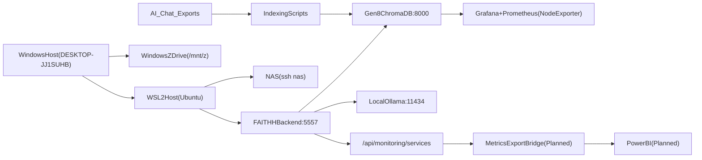

# PHASE1_TRANSPARENCY_AUDIT_2026_03_30

Audit date: 2026-03-30  
Scope: Phase 1 plan execution (read-only evidence + architecture mapping) across WSL2/Windows, Gen8, NAS, and indexing state.  
Mode: read-only checks only (no re-index execution).

---

## 1) What was completed

- Option C follow-up changes were committed first as requested.
  - Commit: `7fa8448`
  - Files: backend monitoring facade integration + transparency docs/index updates
- Remote read-only evidence collected for:
  - WSL2/local backend
  - Gen8 servicebox (SSH)
  - Synology NAS (SSH)
  - Windows host identity via WSL interop (Tailscale SSH to Windows timed out)
- Claude indexing status reconciled using:
  - state files (`project_states.json`, `faithh_memory.json`, `fingerprint_state.json`)
  - audit/review docs
  - scripts readiness
  - live Chroma metadata sampling on Gen8

---

## 2) Evidence snapshot

## Local WSL2 + backend

- Host: `Linux ... WSL2`
- Python: `3.12.3`
- Local backend health (`/health`): `healthy`
  - `chromadb.documents`: `26331`
  - providers enabled: anthropic/gemini/groq/ollama
- Local monitoring endpoint (`/api/monitoring/services`):
  - `overall_healthy: false`
  - unhealthy service observed: `chromadb`
  - response currently includes `unhealthy_services` (legacy key), indicating running backend process may not yet reflect the newest monitoring payload shape from latest committed code.

## Gen8 (`jonat@192.158.1.243`)

- Hostname: `servicebox`
- OS: Ubuntu 22.04 (`5.15.0-171-generic`)
- Docker containers running: `11`
  - Includes: `chromadb`, `grafana`, `prometheus/node-exporter`, `gitea`, `vaultwarden`, `pihole`, `uptime-kuma`, `docker-registry`, `registry-ui`, `gitlab-runner`, `plex`
- Storage:
  - root `/dev/sda2`: ~916G total, ~839G available
- Chroma heartbeat:
  - `http://192.158.1.243:8000/api/v2/heartbeat` responds
- Chroma collection counts:
  - `faithh_knowledge_base: 26331`
  - `alife_lineage: 50450`

## NAS (`ssh nas`)

- Hostname: `ISaidGoodDay`
- OS: Synology DSM kernel `4.4.302+` (DS220j)
- Volume:
  - `/volume1`: ~13T total, ~11T available
- Shares present include: `AI`, `Audio`, `Backups`, `Personal`, `archive`, `homes`
- Tooling:
  - rclone binary present at `/volume1/@appstore/rclone/bin/rclone`
- Backup artifacts:
  - `/volume1/AI/logs` currently empty (no visible `rclone_*.log` files at check time)

## Windows host evidence

- Tailscale SSH check to `100.115.225.100:22` timed out (read-only check attempted).
- WSL interop command succeeded via `cmd.exe` and `powershell.exe` path:
  - Windows product: `Windows 10 Pro`
  - Build: `10.0.26200.8037`
  - Computer name: `DESKTOP-JJ1SUHB`

---

## 3) Topology and data-flow map

---

## 4) Monitoring coverage matrix (current vs gap)

| Area | Current signal | Coverage quality | Gap |
|---|---|---|---|
| FAITHH backend runtime | `/health`, `/api/monitoring/services` | Medium | Endpoint schema drift vs latest code state until backend restart/redeploy |
| Gen8 services | Docker status + Grafana/Prometheus stack available | High | Need documented dashboard ownership and alert thresholds |
| ChromaDB | heartbeat + collection counts | Medium | No canonical time-series capture of per-domain/per-source growth |
| NAS storage/backup | volume + share visibility + rclone binary check | Medium | Backup job evidence/log cadence not surfaced in central dashboard |
| Windows host | identity via WSL interop | Low-Medium | Direct remote telemetry missing (Tailscale SSH timeout path) |
| Cross-system data integrity | ad hoc manual checks | Low | No single registry linking source files, index jobs, and indexed proof |

---

## 5) Claude indexing status memo (audit-only verdict)

### Verdict

**Status: unconfirmed for Mar 2026 Claude export; stale/conflicting state across docs and metrics.**

### Evidence

1. Export availability
   - `AI_Chat_Exports/Claude_Exports/conversations.json`: `68` conversations (Dec export)
   - `AI_Chat_Exports/Claude_Mar2026/conversations.json`: `121` conversations (Mar export)

2. State files and docs conflict
   - `project_states.json` + `faithh_memory.json` still anchor conversation indexing to older snapshots (Jan/older counts language).
   - `docs/REVIEW_RECOMMENDATIONS_2026-03-07.md` explicitly marks Mar 2026 Claude ZIP as "Needs indexing".
   - `fingerprint_state.json` reports a different Chroma total than live checks from this audit.

3. Live metadata signal from Gen8 Chroma (`faithh_knowledge_base`)
   - `platform=claude` documents exist (`3095` docs)
   - observed `timestamp/created_at` max in sampled claude-platform set: `2026-02-27...`
   - this does **not** provide evidence of Mar 6 export ingestion completion.

### Conclusion

- There is clear Claude content indexed historically.
- There is **no strong proof** in current state/docs/metadata that Mar 2026 Claude export indexing completed end-to-end.
- Action required in next phase: formal index proof report (runbook output + recorded counts + timestamped reconciliation).

---

## 6) Hybrid observability plan (Grafana baseline + Power BI roadmap)

## 6.1 Immediate baseline (Grafana-first, current stack)

1. Standardize backend monitoring payload contract and version it in docs.
2. Export FAITHH backend metrics into Prometheus-compatible format (or bridge service):
   - provider health states
   - request volumes, latency buckets, failures
   - Chroma query timings and result cardinality
3. Add NAS backup health ingestion:
   - latest backup run timestamp
   - success/failure
   - bytes transferred
4. Add Chroma inventory panel:
   - total docs per collection
   - docs by `platform` / `source_type` / `domain`

## 6.2 Power BI bridge roadmap

Define one canonical export layer before Power BI modeling:

- Dataset A: runtime health snapshots (`backend`, `providers`, `gen8`, `nas`)
- Dataset B: indexing ledger (`source_path`, `script`, `run_id`, `docs_before`, `docs_after`, `status`, `timestamp`)
- Dataset C: project-state coherence (`project_states` vs key docs drift checks)

Transport options:

1. CSV/JSON scheduled export from WSL to shared path (`/mnt/z/...`) for Power BI Desktop import.
2. Optional lightweight PostgreSQL staging table for incremental refresh if scale increases.

Recommended first Power BI pages:

1. System health overview (host/service status + trend)
2. Indexing integrity (job history, deltas, failures, stale sources)
3. Project coherence (state freshness + doc/state mismatch alerts)

---

## 7) Priority follow-up actions

## P0 (next session)

1. Restart/redeploy backend so monitoring endpoint reflects latest committed schema.
2. Produce a single indexing evidence runbook report for Claude/ChatGPT/Grok exports.
3. Create an indexing registry doc linking script -> source -> collection -> proof query.

## P1

1. Add backend monitoring schema section to `docs/architecture/BACKEND_API.md`.
2. Add one automated consistency check script:
   - compare live Chroma counts vs `fingerprint_state.json` + `project_states.json` claims.
3. Add remote Windows telemetry method resilient to Tailscale SSH outages.

---

## 8) Notes on path visibility

- `/mnt/x` appears as an empty directory at this check time.
- `/mnt/z` is accessible and contains `AI` and `Business`.
- Mount inspection only showed `/mnt/c` in active mount listing during this audit window.
- This suggests Windows drive mapping state should be treated as dynamic and explicitly validated in startup checks.

