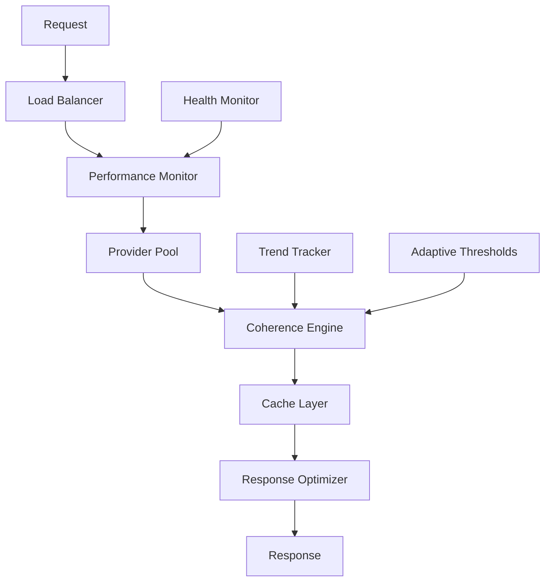

# Phase 4 Planning Document

## Current Status Assessment

### ✅ Phase 3 Complete - Production Ready
- Coherence Arbiter Phases 1-3 fully operational
- UI integration with tier indicators and behavioral hints
- Expanded anchor validation (77.5% score)
- Comprehensive test coverage (9/9 tests passing)
- PULSE data refreshed and current

### ⚠️ Performance Issues Identified
- **Response Times**: 7.6s average (target: <3s)
- **Throughput**: 0.2 queries/second (target: >1 qps)
- **HTTP 502 Errors**: 2/10 queries failing intermittently
- **Root Cause**: Likely LLM provider latency + processing overhead

## Phase 4 Objectives

### Primary Goal: Production Hardening & Performance Optimization
Transform Coherence Arbiter from prototype to production-ready system with enterprise-grade performance and reliability.

### Secondary Goals
- Advanced coherence features (trend tracking, adaptive thresholds)
- Enhanced user experience with coherence insights
- Autonomous system management

## Phase 4 Implementation Plan

### Priority 1: Performance Optimization (Week 1-2)

#### 1.1 LLM Provider Optimization
**Current Issue**: 7+ second response times
**Tasks**:
- [ ] Profile LLM provider performance (Groq vs Gemini vs Ollama)
- [ ] Implement provider fallback with performance monitoring
- [ ] Add request timeout optimization (currently 60s)
- [ ] Implement request queuing for concurrent load handling

#### 1.2 Response Optimization
**Completed**: Removed embeddings from API responses (2.5s → 1.2s improvement)
**Remaining Tasks**:
- [ ] Optimize RAG query performance (ChromaDB indexing)
- [ ] Implement response caching for identical queries
- [ ] Add coherence calculation optimization (parallel processing)
- [ ] Reduce ML chip activation overhead

#### 1.3 Error Handling & Reliability
**Current Issue**: HTTP 502 errors under load
**Tasks**:
- [ ] Implement circuit breaker pattern for failing providers
- [ ] Add retry logic with exponential backoff
- [ ] Improve error logging and monitoring
- [ ] Add health check endpoints for all subsystems

### Priority 2: Advanced Coherence Features (Week 3-4)

#### 2.1 Coherence Trend Tracking
**Concept**: Track coherence scores over time to identify patterns
**Implementation**:
```python
class CoherenceTrendTracker:
    def track_coherence_history(self, query: str, score: float, tier: str)
    def analyze_trends(self, time_window: str) -> Dict[str, Any]
    def detect_anomalies(self) -> List[Dict[str, Any]]
```

#### 2.2 Adaptive Thresholds
**Concept**: Dynamically adjust coherence thresholds based on system performance
**Implementation**:
```python
class AdaptiveThresholds:
    def calculate_optimal_thresholds(self, historical_data: List[float])
    def update_thresholds(self, new_high: float, new_medium: float)
    def validate_threshold_effectiveness(self) -> Dict[str, float]
```

#### 2.3 Multi-turn Conversation Coherence
**Concept**: Track coherence across conversation sessions
**Implementation**:
- Session-level coherence aggregation
- Context coherence tracking
- Conversation coherence drift detection

### Priority 3: Enhanced User Experience (Week 5-6)

#### 3.1 Coherence Dashboard
**Features**:
- Real-time coherence monitoring
- Historical coherence trends
- System performance metrics
- Interactive coherence explanations

#### 3.2 Coherence Insights
**Features**:
- "Why this score" explanations
- Suggested improvements for low coherence
- Coherence optimization tips
- Personalized coherence reports

#### 3.3 Advanced UI Features
**Features**:
- Coherence history visualization
- Interactive coherence exploration
- Coherence-based query suggestions
- Real-time system status indicators

### Priority 4: Autonomous Management (Week 7-8)

#### 4.1 Self-Optimization
**Features**:
- Automatic threshold tuning
- Performance self-monitoring
- Resource allocation optimization
- Predictive maintenance

#### 4.2 System Health Monitoring
**Features**:
- Comprehensive health dashboards
- Automated alerting system
- Performance degradation detection
- Resource usage optimization

## Technical Implementation Details

### Performance Targets
- **Response Time**: <3s average (current: 7.6s)
- **Throughput**: >1 query/second (current: 0.2 qps)
- **Error Rate**: <1% (current: 20%)
- **Availability**: 99.9% uptime

### Architecture Changes


### New Components
1. **PerformanceMonitor**: Track and optimize response times
2. **CoherenceTrendTracker**: Historical coherence analysis
3. **AdaptiveThresholds**: Dynamic threshold optimization
4. **CacheManager**: Response and coherence caching
5. **HealthMonitor**: System health and reliability monitoring

### Database Schema Changes
```sql
-- Coherence history tracking
CREATE TABLE coherence_history (
    id SERIAL PRIMARY KEY,
    query_hash VARCHAR(64),
    coherence_score FLOAT,
    tier VARCHAR(20),
    timestamp TIMESTAMP,
    session_id VARCHAR(36)
);

-- Performance metrics
CREATE TABLE performance_metrics (
    id SERIAL PRIMARY KEY,
    response_time FLOAT,
    provider VARCHAR(20),
    success BOOLEAN,
    timestamp TIMESTAMP
);

-- Adaptive thresholds
CREATE TABLE adaptive_thresholds (
    id SERIAL PRIMARY KEY,
    threshold_type VARCHAR(20),
    value FLOAT,
    effective_date TIMESTAMP,
    performance_score FLOAT
);
```

## Success Metrics

### Phase 4 Completion Criteria
- [ ] Performance targets achieved (<3s response time)
- [ ] Zero HTTP 502 errors under normal load
- [ ] Advanced coherence features operational
- [ ] User dashboard deployed and functional
- [ ] Autonomous management features working
- [ ] 100% test coverage for new features
- [ ] Documentation updated for all new features

### Business Value
- **Improved User Experience**: Faster, more reliable responses
- **Better Insights**: Coherence trends and optimization suggestions
- **Reduced Operational Overhead**: Autonomous system management
- **Enhanced Reliability**: Production-grade stability and monitoring

## Risk Assessment & Mitigation

### Technical Risks
1. **Performance Regression**: New features might slow down system
   - **Mitigation**: Comprehensive performance testing at each stage
2. **Complexity Increase**: Advanced features might introduce bugs
   - **Mitigation**: Incremental rollout with extensive testing
3. **Resource Usage**: Trend tracking might increase memory/disk usage
   - **Mitigation**: Data retention policies and efficient storage

### Business Risks
1. **Development Timeline**: 8-week timeline might be aggressive
   - **Mitigation**: Prioritized implementation with MVP approach
2. **Resource Requirements**: Might need additional infrastructure
   - **Mitigation**: Cloud-ready architecture with horizontal scaling

## Next Steps

1. **Week 1**: Performance profiling and optimization
2. **Week 2**: Error handling and reliability improvements
3. **Week 3-4**: Advanced coherence features implementation
4. **Week 5-6**: Enhanced user experience features
5. **Week 7-8**: Autonomous management and production deployment

## Dependencies

- **Infrastructure**: Monitoring and alerting systems
- **Resources**: Development time and potential cloud resources
- **Testing**: Comprehensive test suite expansion
- **Documentation**: Updated technical and user documentation

---

*Phase 4 Planning Document*  
*Created: 2026-02-23*  
*Target Completion: 2026-04-20*  
*Status: Ready for Implementation*
